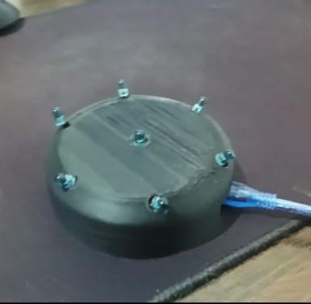
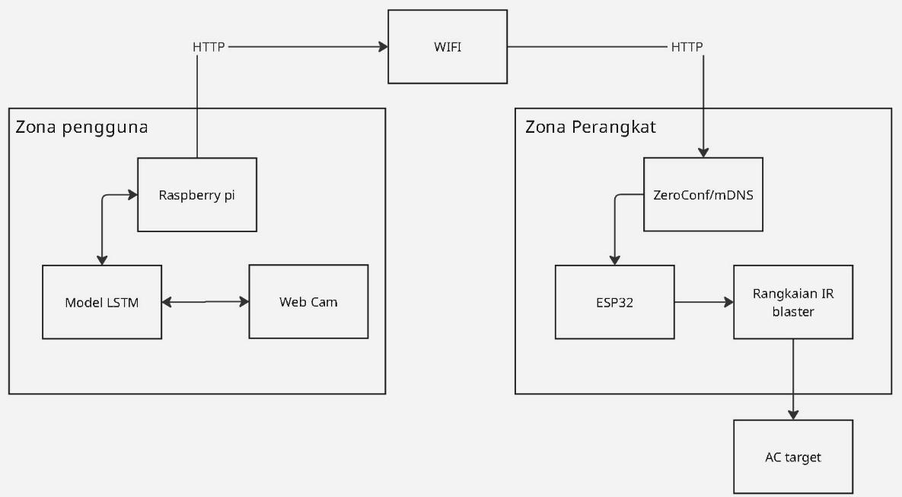
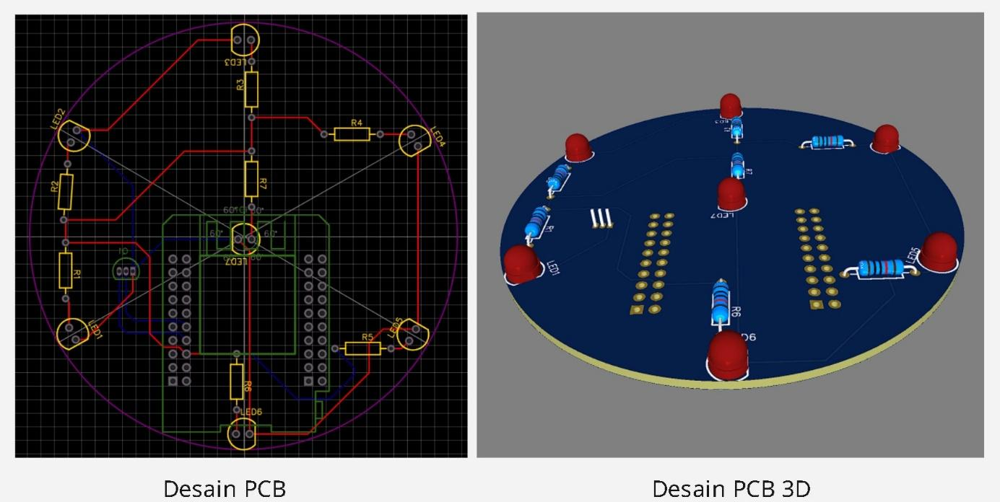
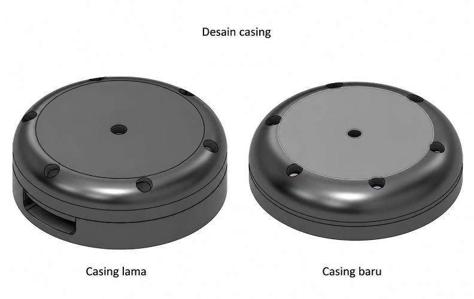

# 🌬️ Smart AC Control via Hand Gestures (LSTM on Edge)
**Kendali AC Berbasis Gesture Tangan Menggunakan LSTM pada Perangkat Edge**

---

## 📖 Tentang Project (About)
Project ini merupakan implementasi sistem kendali pendingin ruangan (Air Conditioner / AC) berbasis **Computer Vision** dan **Edge Computing**. Dikembangkan sebagai solusi atas keterbatasan *remote* inframerah (IR) konvensional yang sering hilang, mudah rusak, dan bergantung pada *line of sight*.

Sistem ini memungkinkan pengguna mengendalikan AC secara *nirsentuh* (*touchless*) hanya dengan menggerakkan tangan di depan kamera. Pemrosesan kecerdasan buatan berjalan sepenuhnya secara lokal (*offline*) di perangkat Raspberry Pi 5 menggunakan model jaringan saraf tiruan berulang **LSTM (Long Short-Term Memory)** untuk memastikan respons yang seketika (*real-time*) dan menjaga privasi pengguna.

---

## ✨ Fitur Utama (Key Features)
Sistem mampu mengenali **6 kelas taksonomi gestur** secara dinamis:
1. 👍 **Thumb Up (Power ON)**: Menghidupkan AC.
2. 👎 **Thumb Down (Power OFF)**: Mematikan AC.
3. 🖐️ **Wave / Mode Toggle**: Mengganti mode AC (Cool / Auto).
4. ☝️ **Temp Up**: Menaikkan suhu target sebesar +1°C (Maks. 30°C).
5. 👇 **Temp Down**: Menurunkan suhu target sebesar -1°C (Min. 17°C).
6. 🚫 **Negative (Idle)**: Menolak pergerakan acak/tidak disengaja (*False Trigger Prevention*).

---

## 🏗️ Arsitektur Sistem (System Architecture)

  

Sistem ini menggunakan arsitektur **Edge-IoT Terdistribusi** yang terbagi menjadi 2 zona:
1. **Zona Pengguna (Vision & AI)**
   - **Perangkat:** Raspberry Pi 5 + Webcam.
   - **Fungsi:** Mengakuisisi video pada 30 FPS, mengekstraksi 21 titik sendi tangan menggunakan **Google MediaPipe**, dan merangkainya menjadi matriks sekuensial (20 frame x 67 fitur spasial). Matriks ini kemudian diproses oleh model LSTM berformat **TFLite** untuk memprediksi probabilitas gestur.
2. **Zona Perangkat (Actuation & IoT)**
   - **Perangkat:** ESP32 D1 Mini + Custom IR Blaster.
   - **Fungsi:** ESP32 berlangganan (subscribe) pada broker MQTT lokal (EMQX). Saat menerima *payload* JSON berisi hasil deteksi, ESP32 menerjemahkannya menggunakan pustaka `IRremoteESP8266` dan menembakkan sinyal inframerah ke arah AC.

---

## 🧠 Pipeline Machine Learning
Model dirancang untuk menangkap dinamika waktu (temporal) dari sebuah gerakan, bukan sekadar bentuk tangan pasif.

- **Ekstraksi Fitur:** 63 metrik jarak relatif sendi + 4 metrik turunan (vektor kecepatan & arah).
- **Model:** 2 Lapisan LSTM bertumpuk + Dropout + Dense Layer (Softmax). Dioptimasi menggunakan TensorFlow Lite Integer-8 Bit Quantization.
- **Performa:** Akurasi pengujian mencapai **99.49%** dengan waktu respons *end-to-end* rata-rata di bawah 1 detik (**0.95 detik**).

---

## 🔌 Desain Perangkat Keras IR Blaster

  
  

Dikarenakan pin GPIO ESP32 tidak mampu menggerakkan beberapa LED IR sekaligus, sebuah sirkuit khusus dirancang:
- Menggunakan **7 buah LED IR TSAL6400 (940nm)** yang disusun melingkar/menyebar (*array paralel-seri*) untuk meminimalisir *blind spot*.
- Ditenagai oleh **Transistor Bipolar NPN 2N2222** sebagai saklar elektronik (penguat arus).
- Dikemas dalam *casing* hasil cetak 3D berbahan PLA dengan desain bukaan bersudut 30 derajat agar pancaran lebih merata hingga jarak efektif 6.9 meter.

---

## 🚀 Instalasi & Menjalankan Sistem
*(Instruksi kode dan detail setup akan diperbarui)*

1. Instalasi dependensi Python di Raspberry Pi: `pip install -r requirements.txt`.
2. Jalankan broker MQTT lokal (EMQX).
3. Kompilasi dan unggah firmware ke ESP32 melalui Arduino IDE.
4. Jalankan script utama di Raspberry Pi: `python main.py`.

---
*Laporan Tugas Akhir oleh Ali Akbar Alhabsyi (2026).*
