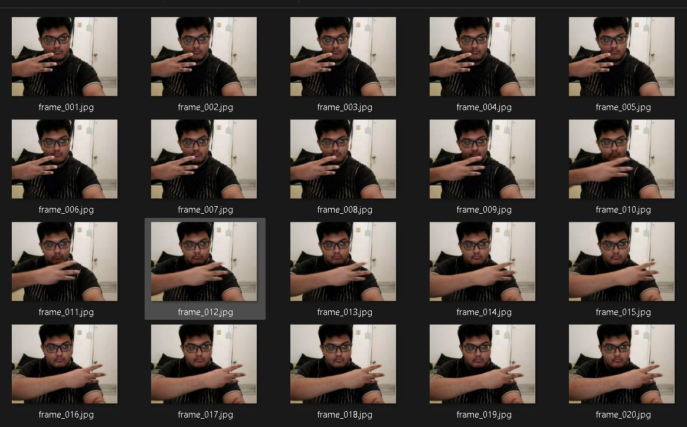
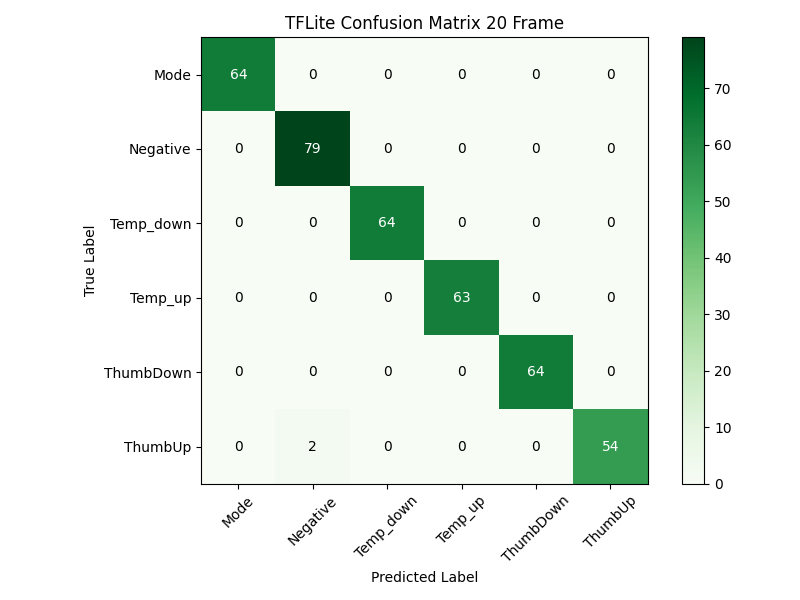
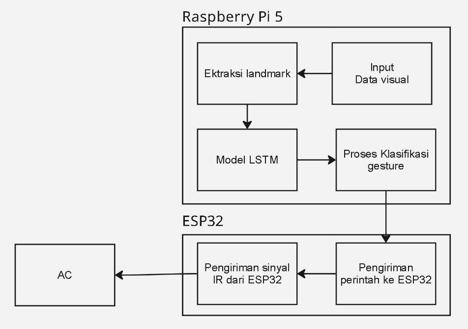

<div align="center">

# 🌬️ Smart AC Control via Hand Gestures (LSTM on Edge)
**Kendali AC Berbasis Gesture Tangan Menggunakan LSTM pada Perangkat Edge**

[]()
[]()
[]()
[]()


</div>

---

## 📖 Tentang Project (About)
Project ini merupakan implementasi sistem kendali pendingin ruangan (Air Conditioner / AC) berbasis **Computer Vision** dan **Edge Computing**. Dikembangkan sebagai solusi atas keterbatasan *remote* inframerah (IR) konvensional yang sering hilang, mudah rusak, dan bergantung pada *line of sight*.

Sistem ini memungkinkan pengguna mengendalikan AC secara *nirsentuh* (*touchless*) hanya dengan menggerakkan tangan di depan kamera. Pemrosesan kecerdasan buatan berjalan sepenuhnya secara lokal (*offline*) di perangkat Raspberry Pi 5 menggunakan model jaringan saraf tiruan berulang **LSTM (Long Short-Term Memory)** untuk memastikan respons yang seketika (*real-time*) dan menjaga privasi pengguna.

---

## 🎥 Video Demo
Silakan lihat aksi sistem ini pada video demo berikut:
[Demo Video](assets/demo_video.mp4)

---

## ✨ Fitur Utama (Key Features)
Sistem mampu mengenali **6 kelas taksonomi gestur** secara dinamis:
1. 👍 **Thumb Up (Power ON)**: Menghidupkan AC.
2. 👎 **Thumb Down (Power OFF)**: Mematikan AC.
3. 🤟 **Mode Toggle**: Mengganti mode AC (Cool / Auto). Dilakukan dengan gerakan 3 jari mengarah ke kiri/kanan.
4. ☝️ **Temp Up**: Menaikkan suhu target sebesar +1°C (Maks. 30°C).
5. 👇 **Temp Down**: Menurunkan suhu target sebesar -1°C (Min. 17°C).
6. 🚫 **Negative (Idle)**: Menolak pergerakan acak/tidak disengaja (*False Trigger Prevention*).

---

## 🏗️ Arsitektur Sistem (System Architecture)

<div align="center">
  
</div>

Sistem ini menggunakan arsitektur **Edge-IoT Terdistribusi** yang terbagi menjadi 2 zona:
1. **Zona Pengguna (Vision & AI)**
   - **Perangkat:** Raspberry Pi 5 + Webcam.
   - **Fungsi:** Mengakuisisi video pada 30 FPS, mengekstraksi 21 titik sendi tangan menggunakan **Google MediaPipe**, dan merangkainya menjadi matriks sekuensial (20 frame x 67 fitur spasial). Matriks ini kemudian diproses oleh model LSTM berformat **TFLite** untuk memprediksi probabilitas gestur.
2. **Zona Perangkat (Actuation & IoT)**
   - **Perangkat:** ESP32 D1 Mini + Custom IR Blaster.
   - **Fungsi:** ESP32 berlangganan (subscribe) pada broker MQTT lokal (EMQX). Saat menerima *payload* JSON berisi hasil deteksi, ESP32 menerjemahkannya menggunakan pustaka `IRremoteESP8266` dan menembakkan sinyal inframerah ke arah AC.

---

## 🧠 Pipeline Machine Learning
Model dirancang untuk menangkap dinamika waktu (temporal) dari sebuah gerakan, bukan sekadar bentuk tangan pasif. Pengenalan gestur dinamis sangat bergantung pada urutan gerakan frame demi frame. 

<div align="center">
  
  <br><i>Visualisasi Urutan Temporal Gestur Dinamis dari Frame 1 hingga Frame 20</i>
</div>

- **Ekstraksi Fitur:** 63 metrik jarak relatif sendi + 4 metrik turunan (vektor kecepatan & arah).
- **Model:** 2 Lapisan LSTM bertumpuk + Dropout + Dense Layer (Softmax). Dioptimasi menggunakan TensorFlow Lite Integer-8 Bit Quantization.

### Hasil Pelatihan (Training Results)
Model telah dilatih dan dikonversi dengan hasil yang sangat memuaskan, mempertahankan akurasi penuh bahkan setelah dikuantisasi ke `.tflite`.

**Akurasi Pengujian: 99.49%**

<div align="center">
  
  
  <br><i>(Kiri: Confusion Matrix Model Keras, Kanan: Confusion Matrix Model TFLite)</i>
</div>

**Classification Report (TFLite & Keras)**
```text
               precision    recall  f1-score   support
         Mode       1.00      1.00      1.00        64
     Negative       0.98      1.00      0.99        79
    Temp_down       1.00      1.00      1.00        64
      Temp_up       1.00      1.00      1.00        63
    ThumbDown       1.00      1.00      1.00        64
      ThumbUp       1.00      0.96      0.98        56
     accuracy                           0.99       390
```

---

## 🔌 Desain Perangkat Keras IR Blaster

<div align="center">
  
  
  <br><i>(Kiri: Layout PCB, Kanan: Skematik Rangkaian IR Blaster)</i>
</div>

Dikarenakan pin GPIO ESP32 tidak mampu menggerakkan beberapa LED IR sekaligus, sebuah sirkuit khusus dirancang:
- Menggunakan **7 buah LED IR TSAL6400 (940nm)** yang disusun melingkar/menyebar (*array paralel-seri*) untuk meminimalisir *blind spot*.
- Ditenagai oleh **Transistor Bipolar NPN 2N2222** sebagai saklar elektronik (penguat arus) yang terhubung ke pin GPIO 17 ESP32.
- Dikemas dalam *casing* hasil cetak 3D berbahan PLA dengan desain bukaan bersudut 30 derajat agar pancaran lebih merata hingga jarak efektif 6.9 meter.

---

## 🚀 Instalasi & Menjalankan Sistem

### Cara Menjalankan di Laptop (Tanpa EMQX / Cloud)
Jika Anda hanya ingin menjalankan klasifikasi gestur di laptop secara lokal untuk pengujian model *Computer Vision* tanpa harus menyambungkannya ke *broker* MQTT/Blynk atau alat ESP32, Anda dapat mengikuti langkah-langkah berikut:

1. Pastikan Anda memiliki Python terinstal di laptop Anda.
2. Instal pustaka yang dibutuhkan:
   ```bash
   pip install opencv-python mediapipe tensorflow numpy
   ```
3. Buka terminal/command prompt di direktori repositori ini.
4. Jalankan *script* inferensi model utama:
   ```bash
   python run_lstm_67fitur_tflite.py
   # atau untuk model Keras:
   # python run_lstm_67fitur_keras.py
   ```
5. Kamera laptop Anda akan menyala, dan Anda dapat langsung mempraktikkan gestur tangan di depan kamera. Prediksi kelas dan status akurasi akan muncul secara *real-time* di jendela *preview*.

---
*Laporan Tugas Akhir oleh Ali Akbar Alhabsyi (2026).*
