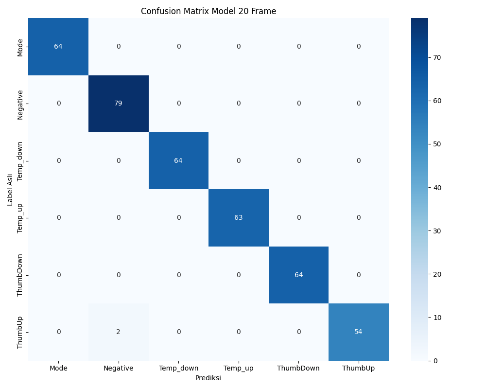

<div align="center">

# Smart AC Control via Hand Gestures (LSTM on Edge)
**Kendali AC Berbasis Gesture Tangan Menggunakan LSTM pada Perangkat Edge**

[]()
[]()
[]()
[]()


</div>

---

## Tentang Proyek
Proyek ini merupakan implementasi sistem kendali pendingin ruangan (Air Conditioner / AC) berbasis **Computer Vision** dan **Edge Computing**. Sistem ini dikembangkan sebagai solusi atas keterbatasan *remote* inframerah (IR) konvensional yang memiliki dependensi pada *line of sight*, rentan mengalami kerusakan, serta risiko kehilangan perangkat fisik.

Sistem ini memungkinkan pengguna untuk mengendalikan AC secara nirsentuh (*touchless*) melalui pergerakan gestur tangan di depan kamera. Pemrosesan kecerdasan buatan dijalankan secara lokal (*offline*) pada perangkat Raspberry Pi 5 menggunakan arsitektur jaringan saraf tiruan berulang **LSTM (Long Short-Term Memory)**. Pendekatan *Edge Computing* ini memastikan waktu respons yang seketika (*real-time*) sekaligus menjaga privasi data pengguna tanpa memerlukan koneksi ke *cloud server* untuk inferensi gambar.

---

## Demonstrasi Sistem

**1. Demonstrasi Kontrol AC dengan Gestur Tangan:**


https://github.com/user-attachments/assets/151e7fdf-b382-4754-98f4-d7a1545a1c7f


**2. Demonstrasi Konfigurasi Antarmuka Web Lokal (Raspberry Pi):**


https://github.com/user-attachments/assets/c203ac36-e5ac-411d-84dc-42918c862cb3


---

## Fitur Fungsional
Sistem ini dirancang untuk mengenali dan mengklasifikasikan **6 kelas taksonomi gestur** secara dinamis:
1. **Thumb Up (Power ON)**: Menghidupkan unit AC.
2. **Thumb Down (Power OFF)**: Mematikan unit AC.
3. **Mode Toggle**: Mengubah mode operasi AC (Cool / Auto). Dilakukan dengan menggerakkan 3 jari secara horizontal (kiri/kanan).
4. **Temp Up**: Menaikkan suhu target sebesar +1°C (Maksimal 30°C).
5. **Temp Down**: Menurunkan suhu target sebesar -1°C (Minimal 17°C).
6. **Negative (Idle)**: Sistem penolakan pergerakan acak (*False Trigger Prevention*) untuk mengabaikan gestur yang tidak disengaja.

---

## Arsitektur Sistem

<div align="center">
  
</div>

Sistem ini menerapkan arsitektur **Edge-IoT Terdistribusi** yang terbagi menjadi dua zona fungsional utama:
1. **Zona Pengguna (Vision & AI)**
   - **Perangkat:** Raspberry Pi 5 dan Webcam eksternal.
   - **Fungsi Utama:** Melakukan akuisisi video pada 30 FPS, mengekstraksi 21 titik koordinat sendi (landmarks) menggunakan kerangka kerja **Google MediaPipe**, dan menyusunnya menjadi matriks sekuensial (20 *frame* x 67 fitur spasial). Matriks tersebut diproses oleh model LSTM berformat **TFLite** untuk memprediksi probabilitas kelas gestur.
2. **Zona Aktuasi (Actuation & IoT)**
   - **Perangkat:** ESP32 D1 Mini dan Modul IR Blaster kustom.
   - **Fungsi Utama:** Bertindak sebagai *subscriber* pada broker MQTT (EMQX). Saat menerima *payload* JSON yang berisi perintah hasil inferensi dari Raspberry Pi, ESP32 menerjemahkannya menggunakan pustaka `IRremoteESP8266` dan mentransmisikan sinyal inframerah ke unit AC.

---

## Antarmuka Konfigurasi Web Lokal (Raspberry Pi)
Sistem ini dilengkapi dengan antarmuka web lokal (`web_rpi`) yang dikerahkan secara *native* pada Raspberry Pi. Fungsi dari antarmuka ini meliputi:
- **Konfigurasi Awal Jaringan (WiFi):** Apabila Raspberry Pi tidak terhubung ke jaringan internet, sistem secara otomatis akan beralih menjadi *Access Point*. Pengguna dapat memasukkan kredensial WiFi rumah melalui halaman portal web ini.
- **Registrasi Perangkat AC:** Pengguna dapat mendaftarkan dan memverifikasi modul IR Blaster ESP32 yang terhubung di jaringan lokal, yang kemudian dicatat ke dalam berkas `devices.json`.
- **Pengaturan Modul Pabrikan:** Antarmuka web mendukung penyesuaian merek pabrikan AC (*Daiki, Panasonic, LG, Sharp, dll.*) secara dinamis agar protokol transmisi IR dapat disesuaikan tanpa memerlukan modifikasi atau kompilasi ulang pada *source code*.

---

## Pipeline Machine Learning
Pengembangan model difokuskan pada penangkapan dinamika temporal dari suatu pergerakan (*dynamic gesture recognition*), bukan sekadar bentuk statis pasif dari tangan pengguna.

<div align="center">
  
  <br><i>Visualisasi Urutan Temporal Gestur Dinamis dari Frame 1 hingga Frame 20</i>
</div>

- **Ekstraksi Fitur:** Terdiri dari 63 metrik jarak relatif sendi dan 4 metrik turunan (vektor kecepatan & arah pergerakan).
- **Arsitektur Model:** 2 Lapisan *Long Short-Term Memory* (LSTM) bertumpuk (*stacked*), diiringi dengan *Dropout* dan *Dense Layer (Softmax)*. Model dioptimasi untuk komputasi perangkat lunak dengan metode *Integer-8 Bit Quantization* melalui TensorFlow Lite.

### Evaluasi Kinerja (Training Results)
Model telah dilatih dengan hasil evaluasi metrik yang sangat memuaskan, mempertahankan presisi tinggi meskipun telah melalui proses kuantisasi ke ekstensi `.tflite`.

**Akurasi Pengujian Kuantitatif: 99.49%**

<div align="center">
  
  
  <br><i>(Kiri: Matriks Konfusi Model Keras, Kanan: Matriks Konfusi Model TFLite)</i>
</div>

**Laporan Klasifikasi (TFLite & Keras)**
```text
               precision    recall  f1-score   support
         Mode       1.00      1.00      1.00        64
     Negative       0.98      1.00      0.99        79
    Temp_down       1.00      1.00      1.00        64
      Temp_up       1.00      1.00      1.00        63
    ThumbDown       1.00      1.00      1.00        64
      ThumbUp       1.00      0.96      0.98        56
     accuracy                           0.99       390
```

---

## Desain Perangkat Keras IR Blaster

<div align="center">
  
  
  <br><i>(Kiri: Layout *Printed Circuit Board* (PCB), Kanan: Skematik Rangkaian IR Blaster)</i>
</div>

Keterbatasan pasokan arus pada pin GPIO standar ESP32 tidak memungkinkan disipasi daya yang cukup untuk serangkaian LED IR secara bersamaan. Oleh karena itu, dirancang sebuah sirkuit penguat daya khusus:
- Menggunakan **7 buah LED IR TSAL6400 (940nm)** yang dikonfigurasi dalam susunan melingkar (*array paralel-seri*) untuk memaksimalkan sudut pancar emisi dan mereduksi *blind spot*.
- Didorong menggunakan komponen **Transistor Bipolar NPN 2N2222** yang bertindak sebagai saklar elektronik (*current amplifier*) dan terhubung ke pin GPIO 17 pada ESP32.
- Modul dikemas di dalam pelindung presisi (*casing*) yang dicetak melalui proses 3D *printing* menggunakan material PLA, dengan desain orientasi sudut bukaan 30 derajat untuk mendistribusikan proyeksi inframerah secara merata dengan rentang operasi efektif hingga 6.9 meter.

---

## Panduan Instalasi dan Operasi Sistem

### Menjalankan Sistem Secara Lokal (Hanya Mode Computer Vision / Tanpa EMQX)
Jika pengujian ditujukan secara khusus pada model *Computer Vision* (inferensi gestur secara lokal pada komputer/laptop) tanpa ketergantungan pada *broker* MQTT maupun aktuator ESP32, langkah-langkah instalasinya adalah sebagai berikut:

1. Pastikan lingkungan komputasi (*environment*) telah dilengkapi dengan **Python (versi 3.8 atau lebih baru)**.
2. Sangat direkomendasikan untuk membuat *Virtual Environment*. Lakukan instalasi dependensi pustaka berikut:
   ```bash
   pip install opencv-python mediapipe tensorflow numpy
   ```
3. Navigasikan terminal *command-line* ke dalam direktori root dari repositori ini.
4. Eksekusi skrip inferensi utama menggunakan perintah berikut:
   ```bash
   # Eksekusi untuk model Keras asli
   python run_lstm_67fitur_keras.py
   
   # ATAU Eksekusi untuk model TFLite terkuantisasi (Direkomendasikan)
   python run_lstm_67fitur_tflite.py
   ```
   *(Catatan Teknis: Pastikan untuk menjalankan skrip yang tidak memiliki postfix `_emqx.py` agar fungsi pengiriman telemetri MQTT diabaikan).*
5. Modul kamera (webcam) akan segera aktif. Algoritma akan melakukan segmentasi dan prediksi berdasarkan kelas gestur yang telah dilatih. Tingkat probabilitas dan kelas terdeteksi akan divisualisasikan secara *real-time* di dalam antarmuka jendela pratinjau.

---
*Laporan Tugas Akhir disusun oleh Ali Akbar Alhabsyi (2026).*
